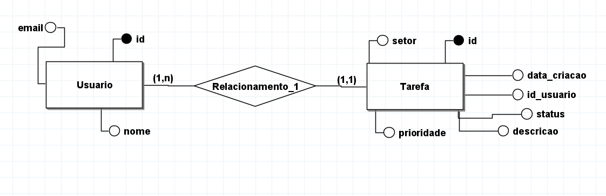

# Projeto de Gerenciamento de Tarefas

## Descrição do Projeto
Este projeto é uma aplicação web para gerenciar tarefas. Ele permite criar, editar, visualizar e deletar tarefas. As tarefas possuem atributos como descrição, setor, prioridade, status, data de cadastro e usuário responsável.

## Tecnologias Utilizadas
- PHP
- Laravel
- Composer

## Configuração do Ambiente
1. Clone o repositório:
    ```bash
    git clone <URL_DO_REPOSITORIO>
    ```
2. Navegue até o diretório do projeto:
    ```bash
    cd nome_do_projeto
    ```
3. Instale as dependências do Composer:
    ```bash
    composer install
    ```
4. Copie o arquivo `.env.example` para `.env`:
    ```bash
    cp .env.example .env
    ```
5. Configure o arquivo `.env` com as informações do seu banco de dados.
6. Execute as migrações para criar as tabelas no banco de dados:
    ```bash
    php artisan migrate
    ```

## Uso
1. Inicie o servidor de desenvolvimento:
    ```bash
    php artisan serve
    ```
2. Acesse a aplicação no navegador:
    ```
    http://localhost:8000
    ```

## Diagramas

### Diagrama de Classes


### Diagrama de Caso de Uso

